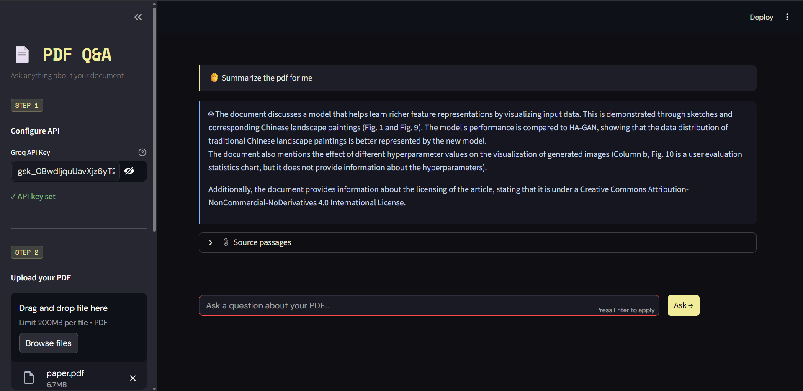

# 📄 PDF Q&A Chatbot


A RAG-based chatbot that lets you upload any PDF and ask questions about it — with source citations.

Built with **LangChain · HuggingFace Embeddings · FAISS · Google Gemini · Streamlit**

---

## 🚀 Quick Start

### 1. Clone the repo
```bash
git clone https://github.com/YOUR_USERNAME/pdf-chatbot.git
cd pdf-chatbot
```

### 2. Create a virtual environment
```bash
python -m venv venv
source venv/bin/activate        # Mac/Linux
venv\Scripts\activate           # Windows
```

### 3. Install dependencies
```bash
pip install -r requirements.txt
```

### 4. Get a free Gemini API key
- Go to https://aistudio.google.com
- Click "Get API Key" → Create key
- It's completely free for personal use

### 5. Run the app
```bash
streamlit run app.py
```

Open http://localhost:8501 in your browser.

---

## 🧠 How it works (RAG pipeline)

```
PDF Upload
    ↓
PyPDFLoader → extract text page by page
    ↓
RecursiveCharacterTextSplitter → 1000-char chunks, 200 overlap
    ↓
HuggingFace all-MiniLM-L6-v2 → embed each chunk locally
    ↓
FAISS → store vectors in memory
    ↓
User question → embed → similarity search → top 4 chunks
    ↓
Gemini 1.5 Flash → generate answer from retrieved chunks
    ↓
Return answer + source passages with page numbers
```

---

## 📁 Project structure

```
pdf-chatbot/
├── app.py              # Streamlit UI
├── rag_pipeline.py     # Core RAG logic (load → chunk → embed → retrieve → answer)
├── requirements.txt    # Dependencies
├── .env.example        # Environment variables template
└── README.md
```

---

## 💡 What you learned building this

- **Document loading** — PyPDFLoader, page-by-page extraction
- **Text chunking** — RecursiveCharacterTextSplitter strategies
- **Embeddings** — HuggingFace sentence-transformers, local inference
- **Vector stores** — FAISS similarity search
- **RAG chain** — RetrievalQA with custom prompts
- **LLM integration** — LangChain + Gemini API
- **UI** — Streamlit for rapid prototyping

---

## 🔧 Improvements to try (Week 2 upgrades)

- [ ] Hybrid search (keyword + semantic)
- [ ] Re-ranking with a cross-encoder
- [ ] Persistent FAISS index (save/load)
- [ ] Multi-PDF support
- [ ] Conversation memory
- [ ] Evaluation with RAGAS
